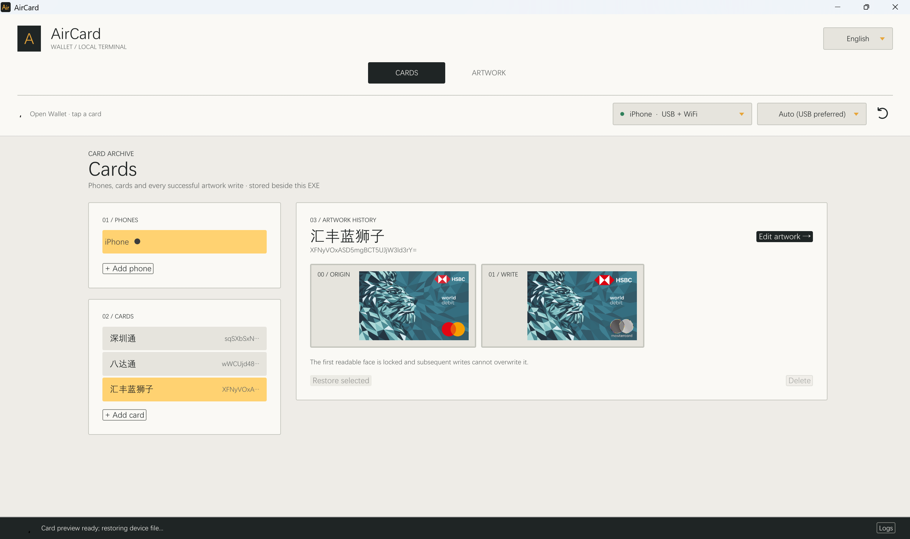

# AirCard for Windows

## 中文

无需越狱、无需安装 iTunes。在 Windows 上修改 iPhone 钱包卡片的背景，并可恢复**首次成功读取并保存的卡面**。卡片和修改历史保存在程序旁的 `Data` 文件夹。

解压后运行 `aircard.exe`，`AppleSupport` 文件夹须与它同级。连接、解锁 iPhone 并信任电脑；电脑需要 [Apple Devices](https://support.apple.com/zh-cn/118290) 提供设备连接，无需安装 iTunes。

在 **Artwork** 中选图并写入，在 **Cards** 中选择卡片和历史记录进行恢复。`ORIGIN` 指首次读取的卡面：如果在首次读取前已经改过卡面，它不一定是出厂原图。使用私有同步接口有风险，请先备份手机。检测到手机后，程序可能请求 UAC 权限，临时创建缺少的 `CoreFP\LibraryPath`，退出时撤销；已有值保持不变。当前卡面预览只保存在内存，提取期间的安全恢复副本暂存在 `Data/recovery`，成功写回手机后清理。

若要使用 Wi-Fi 连接，请在 iPhone 当前所连接 Wi-Fi 网络的设置中关闭 **「专用 Wi-Fi 地址」** 和 **「限制 IP 地址跟踪」**。

## English

No jailbreak or iTunes installation required. Change iPhone Wallet card artwork on Windows and restore the **first successfully captured card face**. Card history stays in the `Data` folder beside the executable.

Extract the archive and run `aircard.exe` with `AppleSupport` beside it. Connect and unlock the iPhone, then trust the computer. [Apple Devices](https://support.apple.com/en-us/118290) is needed for connectivity; iTunes need not be installed. 

Use **Artwork** to prepare and write an image, then **Cards** to select and restore a saved face. `ORIGIN` means the first captured face, which may already have been modified before capture. Back up your iPhone before using the private sync interface. When a phone is detected, AirCard may request UAC to create a missing `CoreFP\LibraryPath` until exit; existing values are left unchanged. Current-face previews stay in memory. Safety recovery copies temporarily use `Data/recovery` and are cleaned up after successful device write-back.

To use Wi-Fi connection, turn off **Private Wi-Fi Address** and **Limit IP Address Tracking** in the settings for your connected Wi-Fi network on the iPhone.

## Credits / 致谢

- [@Lumid-Off](https://github.com/Lumid-Off) — Windows native Rust port and maintainer ([GitHub](https://github.com/Lumid-Off) · [Twitter / X](https://x.com/LumidOff)). Original project: [AirCard-Windows](https://github.com/Lumid-Off/AirCard-Windows).
- [@mak5er](https://github.com/mak5er) — original macOS app and exploit research ([GitHub](https://github.com/mak5er) · [Twitter / X](https://x.com/mak5er)).
- [AirLift](https://github.com/0xjohnnydev/airlift) by [0xjohnny (@0xjohnnydev)](https://github.com/0xjohnnydev) — original AirTraffic/ATAirlock sandbox escape and proof of concept underlying AirliftFFI.
- [@Gazesphotograph](https://github.com/Gazesphotograph) — identified the missing `CoreFP\LibraryPath` setting behind the `ReadyForSync` stall ([issue #4 comment](https://github.com/Lumid-Off/AirCard-Windows/issues/4#issuecomment-5762971784)).
